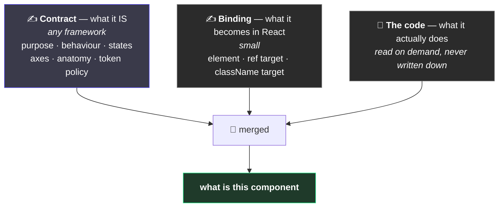
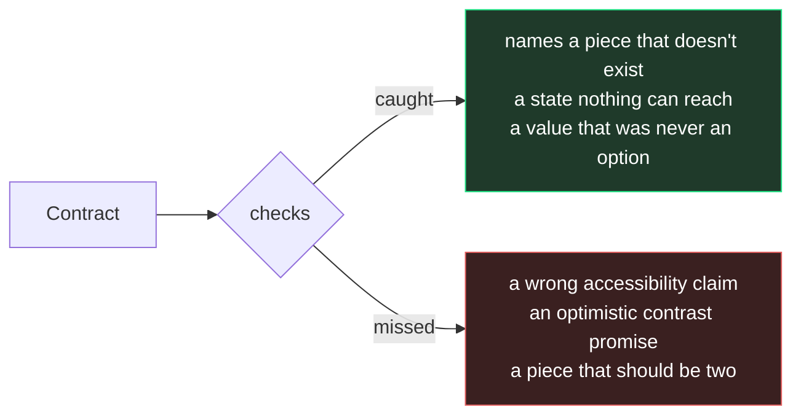

# 2. The two halves of a component

← [Previous](./01-what-this-is.md) · [Index](./README.md) · Next: [Naming the pieces →](./03-anatomy-and-parts.md)

---

## The problem

Open a component in Figma. The properties panel tells you a lot: three sizes, three emphasis
levels, Medium is the default.

Now ask it something else:

- Is this a button or a link?
- If someone puts only an icon in it, who gives it a name a screen reader can read?
- That background — is it _supposed_ to be a surface token, or did someone paste a hex at 6pm?
- Is this finished, or still being figured out?

**There is no field for any of that.** The information exists, in one person's head. They leave,
and the only way to find out is to read the code and guess.

## The split



Three descriptions, none authoritative alone. Ask a question and a tool merges them:

```bash
pnpm contract Button
```

The split between the first two matters more than it looks. **The contract describes a thing with
behaviour and states — not a React thing.** Build the same contract on React Native later and you
write a new binding, not a new contract. What the component _is_ stops being re-decided every time
the platform changes.

## The rule that makes it work

The danger with two files is that they say different things. You have seen it: a Figma component
description saying _"use the Small variant for compact rows"_, written when there were three sizes,
still sitting there now there are five and Small was renamed. The properties panel is always right,
because Figma generates it. The description is right until someone forgets.

So the rule is not "never repeat yourself". It is sharper than that:

> **The contract may say anything. Anything it says that the code also says must be checked equal.**

The contract _does_ list the sizes — it has to, or you couldn't build from it. And because the
sizes can be read straight out of the code, a check compares the two on every run:

```
[parity] Button: axis "size" — contract says [l | m | s | xl], implementation says [l | m | s]
```

Two copies are not dangerous because they are two copies. They are dangerous when nothing compares
them. Here something does, so a disagreement is a failed build rather than a file that quietly
became a lie.

**Where a check is impossible, the old rule still applies.** Nothing can verify a stated purpose or
an accessibility promise, so those are written once, in the contract, and a human reviews them.

## What one looks like

```json
{
  "component": "Button",
  "status": { "level": "experimental", "since": "2026-08-17" },
  "intent": {
    "purpose": "Triggers an action in place. The only control that performs rather than navigates.",
    "notFor": ["Navigation — use Link."]
  },
  "states": {
    "hover": { "kind": "intrinsic", "visual": "fill lightens" },
    "loading": { "kind": "authored", "visual": "busy cursor, label stays" }
  },
  "axes": {
    "size": { "values": ["s", "m", "l"], "default": "m" }
  },
  "semantics": { "role": "button" },
  "a11y": {
    "contrast": "AA",
    "notes": ["Icon-only usage needs a label from whoever uses it. Nothing here can enforce that."]
  },
  "anatomy": {
    "root": { "part": "root", "paints": { "background-color": "--juro-color-fill-" } }
  }
}
```

Note what is **not** in it: no mention of `<button>`, no React. It says the _role_ is a button —
what element that becomes is a separate, much smaller file, because `<button>` and React Native's
`Pressable` are the same meaning on two platforms.

`states` is worth a second look. Every state is classified: **intrinsic** means the platform gives
it to you and you only style it; **authored** means the component has to track it. That single
distinction is what stops someone building a `hover` property.

## The best line in the file

> "Icon-only usage needs a label from whoever uses it. Nothing here can enforce that."

Most documentation says what a thing does. The genuinely useful sentence is the other one — **what
it doesn't do, and whose problem that now is.** No checker can catch that, and nothing in the code
tells you it was deliberate rather than an oversight.

## What is checked, and what isn't



**A confident, wrong accessibility claim passes every check here.** The tooling makes the file
_legal_. Only a person makes it _true_.

---

Next: [Naming the pieces →](./03-anatomy-and-parts.md)
