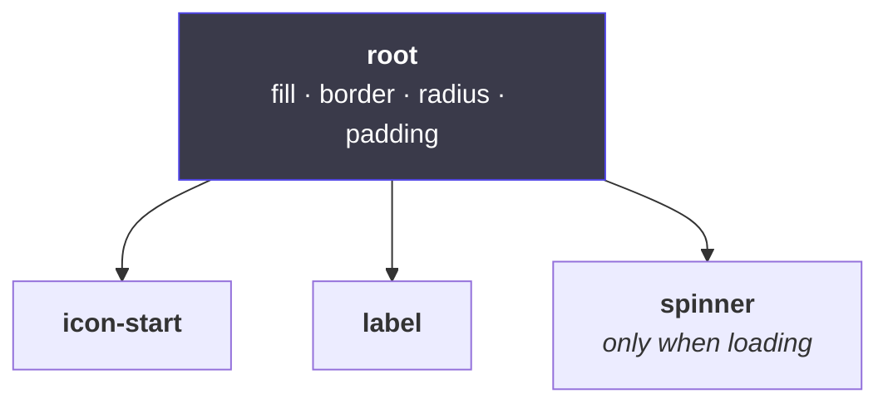

# 3. Naming the pieces

← [Previous](./02-the-two-halves.md) · [Index](./README.md) · Next: [Which token paints what →](./04-tokens-and-paint.md)

---

## This is layer naming, with consequences

A button is a box, an icon slot, a label, sometimes a spinner:



Same instinct as naming layers in Figma. The difference: here a name is a **promise**.

```html
<button data-juro-part="root">
  <span data-juro-part="icon-start">…</span>
  <span data-juro-part="label">Start recording</span>
</button>
```

## Why it earns its keep

**1. Real class names are unreadable.** Behind the scenes `.root` becomes
`Button__root___a1b2c`, and the `a1b2c` changes when the file changes. `[data-juro-part="root"]`
does not move — it is the part we actually promise to keep. So this is supported:

```css
.myToolbar [data-juro-part='label'] {
  letter-spacing: 0.02em;
}
```

**2. It lets the contract be checked.** Because every piece is labelled, a checker can compare
what the contract claims against what actually renders:

| Situation                                         | What happens                                 |
| ------------------------------------------------- | -------------------------------------------- |
| Contract names a piece that isn't rendered        | **Fails.** It describes fiction.             |
| A piece renders that the contract doesn't mention | **Reported, not failed.** Untidy, not a lie. |

**3. It makes the token rules enforceable.** A piece called `label` is styled by a rule called
`label`, so a tool can follow the thread from promise to actual CSS. That is normally impossible —
[next page](./04-tokens-and-paint.md).

## The rule

> **A named piece carries `data-juro-part="x"` and is styled by a rule with the same name.**

Break the pairing and nothing crashes. The component works, tests pass. The token check just
quietly stops being able to see that piece — it degrades from a check into a comment, and nobody
notices for months.

That is the failure mode this repo spends most of its energy on: **the ones that produce no
error.**

## States are not pieces

|           | What it is                        | Example                    |
| --------- | --------------------------------- | -------------------------- |
| **Piece** | exists in the layout              | `label`, `icon-start`      |
| **State** | a condition the whole thing is in | hovered, disabled, loading |

And within states:

- **The browser owns most of them** — hover, focus, pressed, disabled. Free. You do nothing.
- **A few are yours** — `loading`, `current`. Things the browser has no concept of.

So never build a "hover" property. Hover is not something you set, it is something that happens.
Making it a property means writing code to follow the mouse around to do a job the browser has
done for free since the nineties — and it breaks on touchscreens and gets stuck.

Obvious written down. Extremely common in practice, because in Figma hover genuinely _is_ a
variant — there is nowhere else to put it. [Page 6](./06-from-figma-to-component.md) covers that
translation.

## In practice

| You want to                       | Do this                                          |
| --------------------------------- | ------------------------------------------------ |
| Restyle one bit from outside      | target `[data-juro-part="…"]`                    |
| Know what pieces exist            | `pnpm contract Button`                           |
| Argue a component should be split | talk in piece names — they are shared vocabulary |
| Style a hover state               | nothing. It already works.                       |

---

Next: [Which token paints what →](./04-tokens-and-paint.md)
