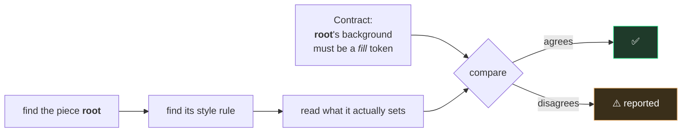
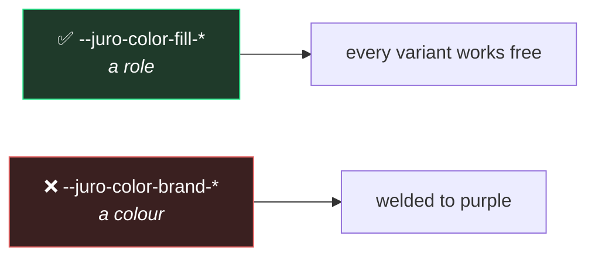

# 4. Which token paints what

← [Previous](./03-anatomy-and-parts.md) · [Index](./README.md) · Next: [The shared vocabulary →](./05-the-shared-vocabulary.md)

---

## The oldest problem

You publish `surface/primary`. Six months later the code says:

```css
background-color: #1e1e1e;
```

Same colour, not the token. Nobody did it on purpose — someone was matching a mockup at 6pm.

Now change the surface colour. That button doesn't move, and nothing tells you, because a hex is
perfectly valid code.

## The contract names a _family_, not a value

```json
"paints": {
  "background-color": "--juro-color-fill-",
  "border-radius": "--juro-radius-",
  "padding-inline": "--juro-space-"
}
```

Read it as: _whatever paints this background must be one of the fill tokens._ Not which one. Which
shelf it came off.

**Why not name the exact token?** Because then it exists twice, and [page 2](./02-the-two-halves.md)
is about why two copies of one fact always drift. The stylesheet is what the browser reads, so the
stylesheet wins. The contract records what the stylesheet _cannot_ say: the intent, which survives
the specific token changing.

It is the difference between _"this heading is 24px Medium"_ and _"this heading uses a Display
style."_ The first breaks when the scale is retuned. The second is still true afterwards.

## How it gets checked

The naming rule from [page 3](./03-anatomy-and-parts.md) is what makes this possible:



```bash
pnpm report:paints
```

```
Button: root: `background-color: #5146e6` does not satisfy `--juro-color-fill-`
Button: root: `border-radius: var(--juro-color-brand-primary)` does not satisfy `--juro-radius-`
```

The first is the hardcoded hex. Expected.

The second is subtler and more common: **a real token, from the wrong family.** Someone used a
colour token to set a corner radius. It produced the right number, so it looked fine. Nothing else
would have flagged it.

## Why this check is unusual

The system this idea came from **cannot do it.** Its own code says so in a comment: there is no way
to get from a named piece to the rule that paints it, so its token policy is documentation rather
than a check.

Here it works, purely because a piece named `label` is styled by a rule named `label`. One naming
convention turns a comment into a check — which is the answer to _"why are we being fussy about
naming?"_

## What a value may be

|                                       | Means                                                     |
| ------------------------------------- | --------------------------------------------------------- |
| `"--juro-space-"`                     | from the spacing tokens                                   |
| `"literal"`                           | deliberately not a token — `transparent`, `0`, a hairline |
| `["--juro-color-border-", "literal"]` | either is fine here                                       |

The last is not a fudge: a border is genuinely transparent at rest and a token when outlined. But
keep the list short — three or four sources usually means the piece should have been two pieces.

**`literal` always wants a reason.** From outside, "a deliberate transparent" and "someone pasted a
value" look identical.

## The rule worth knowing even if you never touch code

> Style against **role** tokens, not **brand** tokens.



`fill`, `border`, `on` are slots that get re-pointed per variant. Build on those and
`variant="danger"` works without anyone writing CSS for it. Build on `brand-primary` and the first
destructive button means rewriting the stylesheet.

Same reason you'd bind a Figma component to a semantic variable rather than a raw colour — and it
fails the same way when you don't.

## It reports, it doesn't block

Deliberately. Its reading of the stylesheet is good but not perfect, and **a check that sometimes
cries wolf gets switched off — a switched-off check protects nothing.** Making it a hard blocker is
a later step, once the list is clean and trusted.

---

Next: [The shared vocabulary →](./05-the-shared-vocabulary.md)
